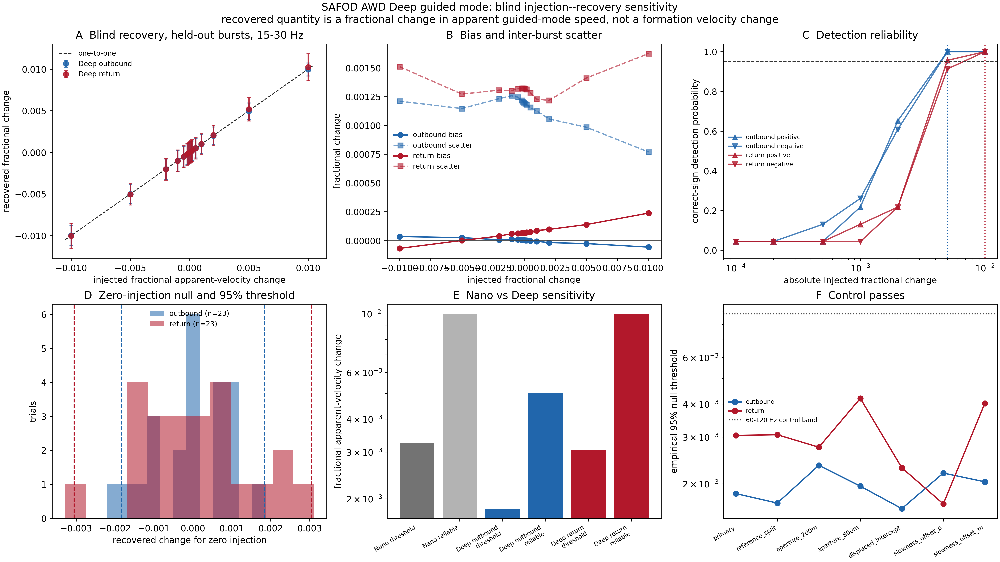

# Deep guided-mode sensitivity — manuscript-ready methods and results

This file resolves the Deep apparent-speed analysis for incorporation into the manuscript. The frozen analysis design is documented in [`DEEP_DVV_PREREGISTRATION.md`](DEEP_DVV_PREREGISTRATION.md), and the authoritative result and claim table is [`DEEP_DVV_STATUS.md`](DEEP_DVV_STATUS.md). Values below are taken from the final, corrected held-out analysis.

---

## Methods

### 3.3 Deep guided-mode identification and split-sample validation

We measured fractional changes in the apparent along-fibre speed of the repeatable slow guided mode recorded by the Deep fibre during the June 2026 accelerated weight-drop survey. The recovered quantity is an observable-level apparent-speed change and is not interpreted as a formation velocity change.

The Deep system recorded 3200 channels at 1000 Hz with 2.0419 m channel spacing. The fibre reverses at channel 1702, producing outbound and return legs. The return leg was re-indexed so that distance increases away from the surface end on both legs. Analysis was restricted to 200–3000 m along each leg and decimated by a factor of six, giving approximately 12.25 m spatial sampling and 229 analysed channels per leg.

Of the 49 bursts in the survey, 46 contained drops common to the Nano and Deep records; the Deep fibre stopped recording after burst 45, so the final three bursts have Nano coverage only and could not have entered a Deep analysis by any route (see `MANUSCRIPT_METHODS.md` §2.3). The analysed set is 859 common drops. These bursts were divided by parity following the earlier split-sample mode validation: 23 odd-indexed bursts formed the discovery set and 23 even-indexed bursts were held out for calibration. The outbound and return legs therefore use the same 23 held-out source bursts and constitute paired observations of distinct fibre paths; they are not 46 independent measurements.

For each leg and frequency band, one linear trajectory was selected using only the discovery-set stack. The search maximised semblance over the full leg for apparent speeds between 1300 and 1800 m s⁻¹ and intercepts between −0.10 and +0.40 s in 2 ms increments. The primary 15–30 Hz trajectories were then frozen at 1544.6 m s⁻¹ and +0.100 s for the outbound leg and 1549.7 m s⁻¹ and +0.346 s for the return leg. The independently selected speeds agree to 0.3%. A 3–15 Hz analysis was retained as a secondary robustness test, and 60–120 Hz, where no coherent mode had been validated, was used as a control band.

### 3.4 Moveout correction, beam construction and the delay-gradient estimator

A fractional speed change produces a delay that accumulates with reference travel time, whereas a source or trigger error shifts the wavefield approximately uniformly. For each burst, we therefore measured delays at multiple positions along the frozen trajectory and fitted

\[
\Delta t(s)=a-\epsilon T_0(s),
\]

where \(T_0(s)\) is the reference travel time, \(a\) is a free intercept that absorbs common-mode timing error, and \(\epsilon\) is the fractional change in apparent speed.

Each leg was divided into 400 m apertures with 200 m spacing, producing twelve apertures per leg. Within each aperture, channels were aligned to the frozen trajectory and averaged into a local beam after each channel was normalised by its time-independent root-mean-square amplitude. Delays relative to a count-weighted leave-one-burst-out reference were estimated by normalised cross-correlation with parabolic sub-sample refinement. The correlation window extended from −80 to +160 ms around the predicted arrival, and the maximum allowed lag was 30 ms.

Apertures were retained when correlation was at least 0.30 and the estimated delay remained within 90% of the lag bound. At least six apertures were required. The delay gradient was estimated with Huber iteratively reweighted least squares, using squared correlation as the weight, and \(\epsilon\) was taken as the negative fitted slope. The delay estimator, robust regression, injection grid, and detection definition were imported directly from the Nano analysis so that the Nano–Deep comparison could not arise from different estimator implementations.

### 3.7 Blind injection–recovery: Deep, blinding and reliability definitions

Sensitivity was calibrated by injecting known fractional speed changes into real held-out data and recovering them through the complete processing chain. For an injected change \(\epsilon_{\mathrm{inj}}\), each channel trace was shifted by \(-\epsilon_{\mathrm{inj}}T_0(s)\) before beamforming. Fifteen levels were tested: zero and \(\pm 1\times10^{-4}\), \(\pm 2\times10^{-4}\), \(\pm 5\times10^{-4}\), \(\pm 1\times10^{-3}\), \(\pm 2\times10^{-3}\), \(\pm 5\times10^{-3}\), and \(\pm 1\times10^{-2}\). This produced 345 trials for each leg and band.

Injection and recovery were separated into blinded stages. The injection stage wrote randomly identified perturbed gathers and a separate sealed truth table. The recovery stage had access only to the blinded gathers, and truth was joined to recovered values during summarisation.

Recovered values were centred on the zero-injection median. The empirical two-sided null threshold was defined as the 95th percentile of the absolute centred zero-injection estimates. The reliable-detection level was the smallest tested magnitude for which at least 95% of trials both exceeded that threshold and had the correct sign in both the positive and negative directions. This is the same criterion used for the Nano observable.

### 3.8 Controls, influence diagnostics and the paired-leg estimator

The primary controls tested synthetic recovery, common-mode timing rejection, dependence on individual apertures or bursts, reference construction, aperture length, and an unvalidated frequency band. Noiseless synthetic guided modes were generated on each leg’s real geometry and perturbed both by re-synthesis at an altered speed and by the injection routine. Timing controls applied either a constant 5 ms shift to every channel or a random per-burst common shift. Influence was assessed by leave-one-aperture-out and leave-one-burst-out analyses.

Because the two legs observe the same source bursts, combinations were formed from 23 paired per-burst estimates rather than by treating the legs as independent populations. Equal, inverse-variance, and covariance-aware combinations were evaluated. Variances and covariance were estimated leave-one-burst-out from the zero-injection pairs, so the weight applied to a burst did not use that burst’s own null estimate. The preselected outbound leg remained the benchmark.

---

## Results

#### 4.6.1 Calibrated sensitivity of all three observables

The preselected outbound branch reached a reliable-detection level of \(5\times10^{-3}\) (0.5%), with an empirical null threshold of \(1.84\times10^{-3}\) (0.184%) and null scatter of \(1.20\times10^{-3}\). The return branch reached \(1\times10^{-2}\) (1%), with a threshold of \(3.05\times10^{-3}\) (0.305%) and scatter of \(1.32\times10^{-3}\). Nano reached \(1\times10^{-2}\) (1%), with a threshold of \(3.25\times10^{-3}\) (0.325%) and scatter of \(1.86\times10^{-3}\).

| Observable | Empirical null threshold | Reliable detection | Sign-only level | Null scatter (MAD) |
|---|---:|---:|---:|---:|
| Nano apparent moveout | \(3.25\times10^{-3}\) | \(1\times10^{-2}\) | — | \(1.86\times10^{-3}\) |
| **Deep outbound** | **\(1.84\times10^{-3}\)** | **\(5\times10^{-3}\)** | \(2\times10^{-3}\) | **\(1.20\times10^{-3}\)** |
| Deep return | \(3.05\times10^{-3}\) | \(1\times10^{-2}\) | \(5\times10^{-3}\) | \(1.32\times10^{-3}\) |
| Deep paired, equal weight | \(1.82\times10^{-3}\) | \(5\times10^{-3}\) | \(2\times10^{-3}\) | \(8.84\times10^{-4}\) |
| Deep paired, inverse variance | \(1.53\times10^{-3}\) | \(5\times10^{-3}\) | \(2\times10^{-3}\) | \(8.12\times10^{-4}\) |
| Deep paired, covariance aware | \(1.67\times10^{-3}\) | \(5\times10^{-3}\) | \(2\times10^{-3}\) | \(7.87\times10^{-4}\) |

The selected outbound Deep branch therefore resolved a tested change a factor of two smaller than Nano. The return branch did not improve on Nano. The supported claim is consequently branch-specific: the selected outbound Deep observable is more sensitive than the Nano apparent-moveout observable under this acquisition and processing design, but the Deep installation as a whole is not shown to outperform Nano.

#### 4.6.2 Timing rejection and robustness

The primary synthetic tests passed on both legs. The worst fractional scale errors were 0.0048 for outbound and 0.0040 for return, zero injection recovered zero, and all injected signs were recovered correctly. In contrast, the 60–120 Hz control band failed the synthetic criterion and did not reach a reliable-detection level in the real-data analysis.

The free intercept separated common-mode timing from propagation delay. A 5 ms constant shift produced fitted intercepts of +4.45 ms outbound and +4.87 ms return, while leakage into the apparent-speed estimate remained \(-4.25\times10^{-5}\) and \(+7\times10^{-7}\), respectively, both far inside their empirical null thresholds.

All primary trials retained at least eleven apertures. Removing one aperture changed the estimate by at most 0.55 times the outbound threshold and 0.52 times the return threshold at the 95th percentile. Removing one burst changed the inferred null threshold by at most 0.16 times the outbound threshold and 0.27 times the return threshold. The result is therefore not carried by a single aperture or burst.

#### 4.6.3 Why the long Deep aperture yields only a twofold gain

The operative regression lever arm, measured across aperture centres used in the fit, was 1.398 s for Deep outbound and 0.121 s for Nano, an 11.5-fold geometric advantage. The observed null scatter improved by only a factor of 1.55. Expressed as an equivalent per-burst timing repeatability, Nano achieved approximately 0.225 ms whereas Deep outbound achieved 1.68 ms, making Deep about 7.4 times worse in timing repeatability. Most of the geometric advantage was therefore consumed by poorer burst-to-burst timing precision, leaving an approximately twofold improvement in tested reliable sensitivity rather than an 11.5-fold improvement.

#### 4.6.4 Paired-leg combination

The zero-injection errors of the two legs were nearly uncorrelated, with \(\rho=+0.121\), so the return leg supplied partially independent information despite sharing the same source impacts. Pairing reduced the core null scatter from \(1.20\times10^{-3}\) for outbound to \(8.12\times10^{-4}\) for the inverse-variance estimator, an improvement of about 1.4. The equal-weight and covariance-aware estimators produced comparable scatter reductions.

However, every paired estimator retained the same smallest tested reliable-detection level as outbound, \(5\times10^{-3}\). The injection grid jumps from \(2\times10^{-3}\) to \(5\times10^{-3}\), so a 1.4-fold precision gain cannot produce a lower reported tested level. The appropriate conclusion is therefore: **combining the two Deep legs reduced the empirical noise floor but did not lower the smallest tested 95% reliable-detection level.**

#### 4.6.5 Return-leg interpretation

The return-leg calibration itself is resolved: its primary 15–30 Hz reliable-detection level is 1%, equal to Nano. What remains unresolved is why it performs more weakly than outbound. The synthetic, timing, monotonicity, aperture-yield, and influence checks pass, and its null scatter is only 10% larger than outbound despite substantially lower validation beam power.

The displaced-intercept and slowness-offset controls cannot identify the cause. Because the injection shifts each entire channel trace by a position-dependent amount, any coherent energy inside the extraction window receives the injected perturbation and can be recovered even when the extraction trajectory is intentionally displaced. These controls behaved similarly on both legs and are therefore non-diagnostic. The unvalidated 60–120 Hz band remains the meaningful negative control. The manuscript should report the return branch as a calibrated secondary result whose weaker performance is not yet mechanistically classified, rather than assigning it to signal-to-noise limitations.

---

#### 4.6.6 Interpretation and claim boundary

The recovered quantity is a fractional change in the apparent along-fibre speed of the selected slow guided mode. It has no depth resolution and is not a measurement of formation \(V_P\) or \(V_S\), fault-zone stress, pore pressure, permeability, fracture compliance, or tectonic strain. Conversion to any of these quantities would require a guided-wave forward model and independent constraints not available here.

The injection–recovery analysis calibrates the sensitivity of the observable as constructed. Attribution of the observable to a real spatially ordered guided mode relies on the earlier split-sample validation and channel-order permutation tests, in which the unpermuted held-out result exceeded all 499 permutations in each of four leg-and-band tests (\(p=0.002\)). The present analysis does not independently establish the physical phase identity or generation depth of that mode.

The all-46-burst analysis is not used for the headline claim because the trajectory was selected from half of those bursts. It is retained only as a check that the 23-burst held-out threshold is not solely a small-sample artefact. With only 23 held-out null trials, the empirical 95% threshold is controlled by an extreme order statistic; estimator comparisons should therefore rest primarily on null scatter and the predeclared tested detection levels rather than small differences between thresholds.

---

## Manuscript-ready summary paragraph

Blind injection–recovery tests calibrated fractional changes in the apparent along-fibre speed of the selected Deep guided mode using 23 held-out bursts and the same estimator and injection grid applied to Nano. The preselected outbound branch reached reliable detection at \(5\times10^{-3}\) (0.5%), compared with \(1\times10^{-2}\) (1%) for both the return branch and the Nano apparent-moveout observable. Although the Deep regression lever arm was 11.5 times longer than Nano’s, its inferred per-burst timing repeatability was 7.4 times worse, so the geometric advantage produced an approximately twofold rather than an order-of-magnitude sensitivity improvement. Combining the two Deep legs reduced the null scatter by about 1.4 but did not lower the smallest tested 95% reliable-detection level. These results establish improved sensitivity for the selected outbound Deep branch only and do not imply an installation-wide advantage or a formation-velocity measurement.

---

## Reproducibility files

| File | Role |
|---|---|
| [`DEEP_DVV_PREREGISTRATION.md`](DEEP_DVV_PREREGISTRATION.md) | frozen interpretation rules and paired-leg addendum |
| [`DEEP_DVV_STATUS.md`](DEEP_DVV_STATUS.md) | authoritative result and claim table |
| `deep_dvv_frozen_trajectory.json` | frozen trajectory definitions |
| `deep_dvv_injection_recovery.py` | blinded freeze, injection, recovery, and summary stages |
| `deep_dvv_synthetic_validation.py` | per-leg synthetic geometry and injection validation |
| `deep_dvv_influence.py` | leave-one-aperture-out and leave-one-burst-out diagnostics |
| `deep_dvv_paired_legs.py` | paired-leg estimators and error correlation |
| `deep_dvv_nano_comparison.csv` | Nano–Deep comparison |
| `deep_dvv_paired_comparison.csv` | paired-leg comparison |
