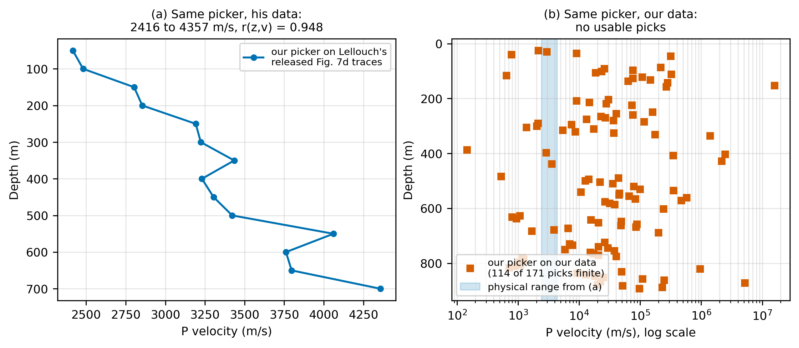
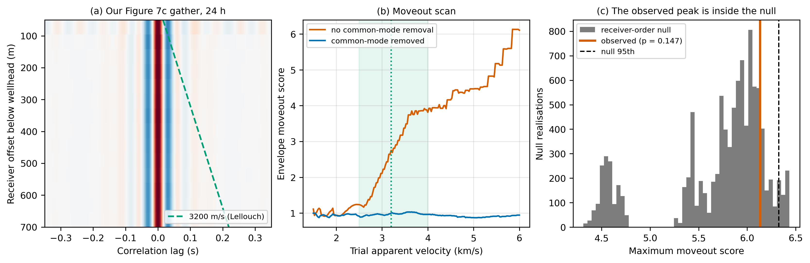
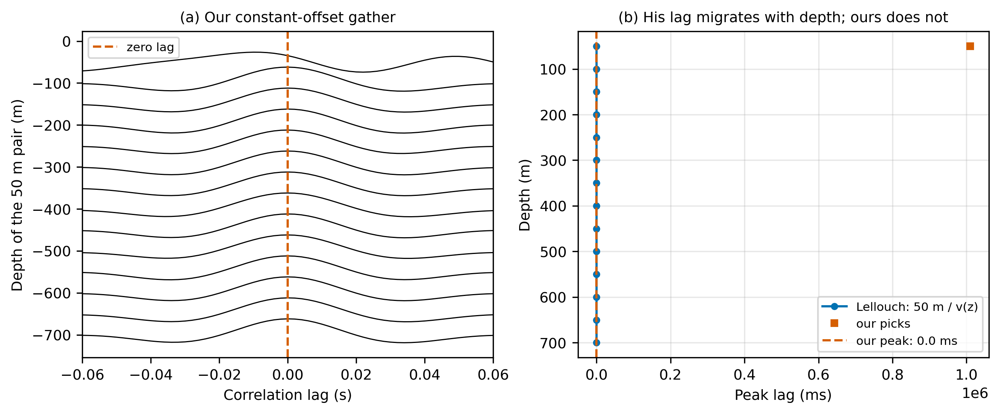
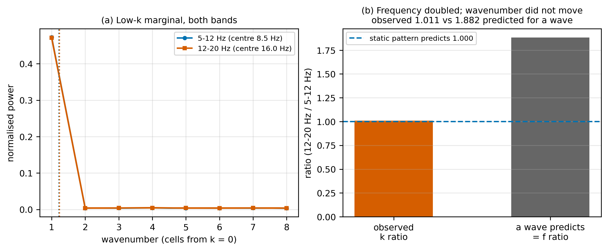
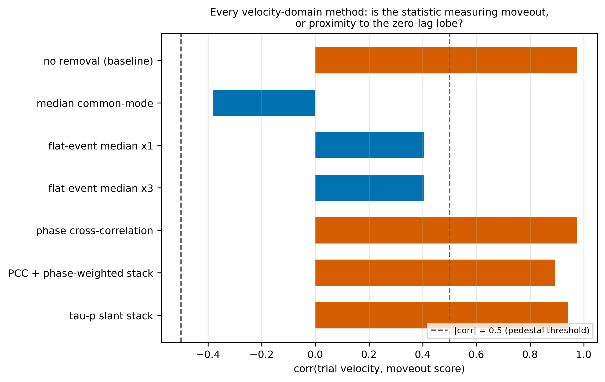
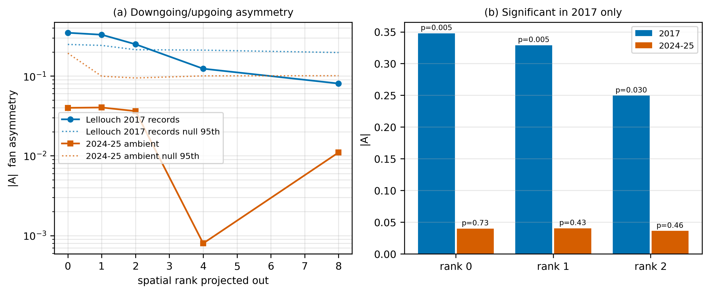
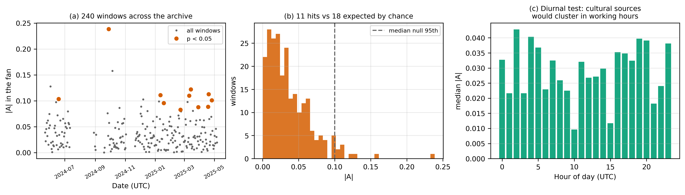

<!-- GENERATED by assemble.py from sections/*.md -- do not edit -->

# Ambient-noise body-wave interferometry is illumination-limited, not processing-limited: a failed reproduction of Lellouch et al. (2019) Figure 7c on a later SAFOD DAS deployment

## Abstract

Lellouch et al. (2019) recovered a downgoing ~3.2 km/s P-wave packet from one day
of ambient noise on a distributed acoustic sensing (DAS) array in the San Andreas
Fault Observatory at Depth (SAFOD) main hole, and used the resulting virtual-source
gathers to estimate a P-velocity profile. We attempted to reproduce that result on
a 2024-2025 continuous DAS archive from the same borehole and the same fibre, and
we could not. This paper reports the failure and, more usefully, identifies its
cause.

We first establish that our implementation is correct: applying our picker to
Lellouch's own released correlograms returns a monotonic profile from 2,416 to
4,357 m/s with a depth-velocity correlation of r = 0.948, the range and behaviour
his Figure 9 reports, while the same picker on our data returns velocities
spanning 146 to 1.6e7 m/s with a median of 26,380 m/s -- five orders of magnitude
of scatter about a value an order of magnitude above any crustal velocity. Applied to our archive, the same processing yields no arrival. Six
independent days give a minimum p-value of 0.1345 against a receiver-order
permutation null, with a Fisher combination of p = 0.524; a coherent four-day
stack gives p = 0.9184; and the observed moveout score exceeds the per-velocity
null at 0 of 181 trial velocities. In the
constant-offset geometry that produced the published velocity model, his
correlation peaks migrate from 20.7 to 11.5 ms with depth while ours sit at
exactly zero lag at every depth.

Eight velocity-domain methods fail identically: fixed-fan f-k filtering with
brick-wall and raised-cosine masks, tau-p slant stacking with a slowness-mute
sweep, rank-k subspace projection, phase cross-correlation, phase-weighted
stacking, offset-axis median flat-event removal, and median and mean common-mode
removal. We show why. The field is dominated by a **static spatial pattern at fixed
wavenumber**: raising the analysis band from 5-12 Hz to 12-20 Hz doubles the centre
frequency (ratio 1.882) but moves the low-wavenumber power centroid by 1.1 %
(ratio 1.011), where a wave at fixed velocity requires the two ratios to be equal.
A pattern at fixed wavenumber has no velocity, so no velocity-domain filter can
separate it. We additionally implement the adaptive f-k filter of Isken et al.
(2022), the one f-k family not previously tried, which makes no velocity
assumption.

The decisive result is upstream of all of this. Lellouch's evidence for
surface-origin sources is the amplitude asymmetry between downgoing and upgoing
energy. We measure that asymmetry directly. It is significant in his 2017 records
(|A| = 0.348, p = 0.005) and absent from ours (|A| = 0.040, p = 0.73) under
identical processing at matched spatial ranks; a pre-registered scan of 240
windows spanning one year of archive finds 11 significant windows against 12.0
expected by chance. The wavefield we recorded contains no net downgoing component
in this band, and no filter can create a propagation direction that is not in the
data.

We conclude that borehole ambient-noise body-wave interferometry is limited first
by **illumination** and only then by processing. For two receivers on a vertical
line the stationary-phase sources lie in a narrow cone directly above the
wellhead, so the method depends on local, often cultural, near-vertical-incidence
noise that may simply be absent. Because the same fibre in the same borehole
yielded a positive result in 2017 and a null in 2024-2025, medium properties
cannot account for the difference, and the reproducibility of published
ambient-noise body-wave results should not be assumed to transfer across
deployments at a single site. We recommend that the asymmetry measurement reported
here be run as an inexpensive feasibility gate before any such campaign, and we
report the negative alongside every control, including several of our own claims
that we withdrew during the work.

## 1. Introduction

Seismic interferometry retrieves the Green's function between two receivers by
cross-correlating the ambient wavefield they both record. In borehole geometry the
appeal is direct: a vertical array of receivers, correlated against one another,
should yield the vertical travel times and hence a velocity profile, with no
active source and no additional acquisition cost. Distributed acoustic sensing
(DAS) makes the geometry unusually favourable, since a single fibre provides
hundreds of channels at metre spacing down the hole.

Lellouch et al. (2019) demonstrated this at the San Andreas Fault Observatory at
Depth (SAFOD). Using an OptaSense ODH3.1 interrogator on the main-hole fibre in
June 2017, they cross-correlated ambient noise against a fixed shallow virtual
source and, after a 5-20 Hz bandpass, recovered an impulsive arrival on the causal
side of the correlation functions with an apparent velocity of about 3,200 m/s,
which they interpreted as a downgoing P wave. Their Figure 7c shows the
fixed-source gather; their Figure 7d shows a constant-offset variant; and their
Figure 9 presents the P-velocity profile derived from it. They attribute the
dominant ambient sources to the surface, inferring this from the amplitude
asymmetry between the downgoing and upgoing energy, and they note that the
approach "can be especially helpful in seismically quiet areas."

That result is a natural reproduction target. The SAFOD fibre remained in place,
and a continuous DAS archive was recorded on it from May 2024 to May 2025 -- the
same borehole, the same fibre, the same rock, roughly seven years later. If
ambient-noise body-wave interferometry is a robust monitoring tool, as the
time-lapse literature assumes when it proposes using it for reservoir or
fault-zone surveillance, it should reproduce.

It does not. This paper documents that failure in full, because the reason turns
out to be more informative than a successful reproduction would have been.

Our contribution is threefold.

**First, we separate implementation error from data.** Reproduction failures are
uninformative unless the implementation is independently validated. We validate
ours against Lellouch's own released correlograms: the picker described in his
paper, applied to his data, returns the monotonic 2,416-4,357 m/s profile his
Figure 9 reports (depth-velocity r = 0.948), and the identical picker applied to
our data returns physically impossible velocities spanning five orders of
magnitude. The processing is therefore not
at fault.

**Second, we explain why an entire class of remedies cannot work.** Eight
velocity-domain methods, including two f-k mask families, tau-p slant stacking and
rank-k subspace projection, fail in the same way. We show that this is not eight
independent failures but one: the field is dominated by a static spatial pattern at
fixed wavenumber, which has no apparent velocity and therefore cannot be separated
by any operator that discriminates on velocity. We also implement and test the
adaptive f-k filter of Isken et al. (2022), which makes no velocity assumption and
which was the one f-k family we had not tried.

**Third, and most usefully for practitioners, we identify the binding
constraint.** Body-wave retrieval on a vertical array requires noise sources in
the stationary-phase zone for a vertical path, which is a narrow cone directly
above the wellhead. That illumination is local and frequently cultural. We
measure the downgoing/upgoing asymmetry that Lellouch used as his own evidence for
surface sources, find it in his data and not in ours, and confirm the absence with
a pre-registered scan over one year of archive. The reproduction fails because the
wavefield lacks the required component, not because the processing lacks skill.

This matters beyond one figure. Behm (2016) retrieved borehole P and S waves by
the virtual-source method in a producing oil field and found that "ambient noise
from time periods as short as 30 seconds is sufficient to obtain robust
interferograms" -- illumination there came from surface industrial activity. If 30 s
suffices when illumination is adequate, then a campaign that fails after days of
stacking is not under-sampled; it is unilluminated. Our own stacks behave exactly
this way: they get *worse* with more data. Treating non-detection as a signal-to-noise
problem, and answering it with longer records or more aggressive filtering, is
then a category error, and one that consumes substantial acquisition and compute
budget before it is discovered.

We therefore recommend the asymmetry measurement as an inexpensive feasibility
gate: it requires seconds of data, no velocity assumption, and no correlation
stack, and it would have told us at the outset that this particular reproduction
was not available.

## 2. Data

### 2.1 The two acquisitions

Both datasets come from the same fibre in the SAFOD main hole. Lellouch et al.
(2019) report a fibre under approximately 1 N tension in a 0.9 mm steel tube
cemented between casing strings, reaching 864 m, with analysis limited to 800 m by
a loop failure at the fibre end.

| | Lellouch et al. (2019) | This study |
|---|---|---|
| recorded | June 2017 | 2024-05-21 to 2025-05-06 |
| interrogator | OptaSense ODH3.1 | `SAFOD-Zumberge-16mGL-500HzFs` |
| channel spacing | 1.0 m | 1.0209 m |
| sample rate | 250 Hz | 500 Hz |
| gauge length | 10 m | 16.335 m |
| recorded quantity | — | optical phase, `rad * 2PI/2^16` |
| available to us | 2 earthquake records (800 x 1250, 250 Hz) plus stacked correlograms | 377,680 continuous 60 s records |

The acquisitions differ in interrogator and gauge length. Channel spacing is
effectively identical. We quantify the gauge-length difference in section 3.4 and
find it far too small to matter: the `sinc(pi k L)` response attenuates a 3,200 m/s
arrival by 0.1-1.1 % across 5-20 Hz.

An important asymmetry in what is available: Lellouch's public release contains raw
data only for two earthquake records (`M1p33`, `M2p46`) plus **stacked**
correlograms, which the release documentation describes as "a stack of 7 different
one-day correlations". The raw ambient data behind his Figure 7c is not public.
Our 2017 measurements therefore use the pre-event portions of the two earthquake
records, and we state explicitly where that limits the comparison (section 6.2).

### 2.2 Verifying that the 2017 comparison windows are noise

Because `M1p33` and `M2p46` are earthquake records, using them as an ambient proxy
requires knowing that the analysed portion precedes the arrival; otherwise a
comparison against our ambient data would contrast a loud coherent arrival with
noise. We picked the arrivals rather than assuming: a short-term-average trigger at
3x the quiet-quarter level places them at **4.100 s** and **4.916 s** of 5.00 s
records. Our comparison window is the first 2.5 s, so both arrivals fall outside
it and both arms of every cross-epoch comparison below are noise.

This check was not incidental. We initially withdrew our central cross-epoch
result on the suspicion that this window contained an earthquake, and the
measurement showed the withdrawal was unnecessary. Section 6.3 records that.

## 3. Methods

### 3.1 Faithful reproduction

We implement only the operations reported in Lellouch et al. (2019) section 4.1:
time differentiation of recorded phase to a strain-rate proxy; running-absolute-mean
temporal normalisation; 30 s correlation windows with 15 s overlap over a
continuous day; a fixed shallow virtual source with receiver centres every 50 m
from 50 to 700 m; the published neighbour sum `C_{S,R} = sum_{Z=R-10}^{R+10} C_{S,Z}`;
simple unshifted stacking; and a 5-20 Hz bandpass applied to the stacked
correlations. The bandpass is applied to the full correlation and only then cropped
in lag, since the reverse order aliases energy into the retained window.

Cross-spectra are accumulated in the frequency domain with
`n_fft = 2^ceil(log2(2W-1))`, so the correlation is linear rather than circular.
The paper does not report a running-absolute-mean duration; we use 0.1 s following
Bensen et al. (2007), who recommend approximately half the maximum period of the
analysis band, and we treat it as a declared sensitivity rather than a recovered
constant. Common-mode removal and source-power stabilisation are available only as
labelled sensitivity branches, and f-k filtering is absent from the baseline
because it is not reported in the paper's ambient-interferometry section.

Day-level products are stored as summed cross-spectra in resumable chunks, which
allows exact full-day aggregation and convergence analysis without recomputing
correlations. We verified that an independent re-sum of one day's 24 chunks
reproduces the stored aggregate to a maximum absolute difference of 0.000e+00, and
that window counts match expectation (5,759 for a contiguous day).

### 3.2 Statistics and controls

Our decision statistic is the maximum envelope moveout score over a declared
1,500-6,000 m/s scan. The null is a **receiver-order permutation**: offsets are
held fixed and receiver identities permuted, so each null realisation carries the
same geometry as the observation, and the velocity selection is repeated
independently in every realisation to account for choosing a velocity after
inspecting the published figure.

Two additional controls matter. First, we report a **per-velocity** null in
addition to the familywise one, since a familywise maximum can hide the fact that
no individual velocity is anomalous. Second, we report a **pedestal diagnostic**,
`corr(trial velocity, moveout score)`. A moveout score that rises monotonically
with trial velocity is measuring proximity to the zero-lag lobe rather than
moveout, and its p-value is then not interpretable as a detection. We use
|corr| < 0.5 as the threshold for a statistic that measures what it claims to.

Every script in this study refuses to declare a recovery unless the pedestal is
suppressed, the peak lies inside 2,500-4,000 m/s, the peak is not at a scan edge,
the causal side dominates at 3,200 m/s, and p < 0.05. These gates exist because
four automated verdicts were printed from broken inputs during this work; all four
are recorded in section 6.3.

### 3.3 The illumination measurement

Lellouch's evidence for surface sources is the amplitude asymmetry between
downgoing and upgoing energy. We measure it as

    A = ( E(+k) - E(-k) ) / ( E(+k) + E(-k) )

over the frozen 2,500-4,000 m/s fan at **positive frequencies only**. The
restriction is essential: for real input `P(-k,-f) = P(k,f)`, so a budget over all
frequencies would make the two signs identical by construction and force A = 0. We
report |A| only, since which sign corresponds to downgoing depends on a
channel-ordering convention, whereas the existence of a preferred direction does
not.

The null shuffles fan-cell powers between the +k and -k halves, preserving total
fan energy and the marginal distribution of cell powers while destroying any
directional preference.

One correction is central to interpreting our numbers. A separable field
`x(ch,t) = a(ch) s(t)` has `P = |A(k)|^2 |S(f)|^2`, and for real `a(ch)` this gives
`|A(-k)| = |A(k)|` exactly -- perfect k-symmetry, so |A| = 0 regardless of
illumination. Because our field is dominated by exactly such a static pattern
(section 4.4), |A| must be measured **after** projecting out the leading spatial
subspace. We sweep the rank so the reader can see the answer emerge, and we note
that high ranks are conservative against detection, since a genuinely low-rank
plane-wave arrival would also be removed.

### 3.4 Adaptive f-k

We implement the adaptive f-k filter of Isken et al. (2022), which differs from
every other f-k filter used here in assuming no velocity. The mask is the data's own
amplitude spectrum raised to an exponent, computed in sliding time-space windows
with 50 % overlap and Bartlett-tapered recombination, and the amplitude spectrum is
deliberately not smoothed, following their finding that smoothing "distorts the
signal amplitudes and narrows the filter band". A normalised variant retains the
amplitude of the most dominant f-k component.

Before use on real data we verified four properties: an exponent of zero is a
bit-identical no-op; Bartlett 50 %-overlap recombination reconstructs the input to
a maximum relative error of 0.000e+00; the filter raises the coherence of a
synthetic 3,200 m/s plane wave in noise from 0.0523 to 0.1980; and, critically, it
does **not** manufacture moveout from pure noise (0.0000 to 0.0000). The last check
targets the failure mode that recurred throughout this study.

Because an adaptive filter enhances the *dominant* coherent component, and ours is
the static pattern, we predicted in advance that applying it without prior spatial
removal would amplify the contaminant. That prediction was recorded before the run
and is tested in section 4.6.

## 4. Results

### 4.1 The implementation is correct (Figure 2)

**Figure 2. The implementation is correct; the data is not.** (a) Our picker, unchanged, applied to Lellouch's own released constant-offset correlograms: 14 of 14 depths return a pick, rising monotonically from 2,416 to 4,357 m/s, the range his Figure 9 reports, with a depth-velocity correlation of r = 0.948. Note that r = 0.948 is the correlation between depth and velocity on these picks, not a point-by-point match to his published curve, which is not digitised here. (b) The identical picker on our archive, log scale: 114 of 171 fibre positions return a pick, but they span 146 to 1.6e7 m/s with a median of 26,380 m/s, against the physical range from (a) shaded for comparison. The failure is not that the picker returns nothing; it is that it returns whatever noise maximum falls in its search window, which is what a picker does when the correlation contains no arrival.

Before reporting a null we establish that the processing works. Lellouch's release
includes stacked correlograms for the constant-offset geometry. Applying our
picker -- a three-sample maximum with parabolic interpolation, following Nakata &
Snieder (2012) as his paper specifies -- to *his* correlograms yields a
monotonically increasing profile rising from **2,416 m/s at 50 m to 4,357 m/s at
700 m**, with a depth-velocity correlation of **r = 0.948**. That range and that
monotonicity are what his Figure 9 reports.

We are deliberately precise about what this does and does not show, because an
earlier draft of this work -- and this project's own planning document --
described the same number as our picker "recovering his published Figure 9
velocity model". It is not that. The 0.948 is the correlation between depth and
the velocities our picker returns from his traces; his published Figure 9 curve is
not digitised in our repository, so no point-by-point agreement with it is
established.

What matters for the null is the contrast, and it is stark. The *same picker,
unchanged*, returns a physically sensible profile from his data and nothing usable
from ours:

| | picks returned | velocity range | median |
|---|---|---|---|
| his released traces | 14 of 14 | 2,416 - 4,357 m/s | 3,268 m/s |
| our archive | 114 of 171 fibre positions | 146 to 1.6e7 m/s | 26,380 m/s |

Our failure is not that the picker returns nothing; it is that what it returns is
physically impossible -- five orders of magnitude of scatter about a median an
order of magnitude above any crustal P velocity. That is what a picker does when
handed a correlation with no arrival in it: it reports the position of whatever
noise maximum happens to fall in the search window. The picker, the geometry, the band and the moveout logic are
therefore not at fault. Anything that follows is a statement about the data.

### 4.2 Figure 7c does not reproduce (Figure 1)

**Figure 1. Figure 7c does not reproduce.** (a) Our fixed-source R+-10 gather from 24 h of 2024-12-20, with the 3,200 m/s trajectory Lellouch reports overlaid; no arrival follows it. (b) The moveout scan for the baseline and common-mode-removed branches. The baseline rises monotonically with trial velocity, the signature of a statistic measuring proximity to the zero-lag lobe rather than moveout. (c) The observed maximum against 5,000 receiver-order permutations; the observation sits inside the null.

Applying the same processing to the 2024-2025 archive yields no arrival that
survives its controls.

| test | result |
|---|---|
| best single day, familywise p | **0.1345** (2024-11-30, 21.3 h block) |
| six independent days | none reach p < 0.05 |
| Fisher combination over five independent days | chi-sq = 9.08 on 10 df, **p = 0.524** |
| coherent four-day stack, 23,036 windows | **p = 0.9184** |
| per-velocity null, 181 trial velocities | **0 clear the 95th percentile** |
| at 3,200 m/s specifically | score 2.752 against a threshold of 2.811 |
| detectability of the four-day stack, peak / null 95th | **0.72** (needs 1.00) |

The Fisher combination is worth its own line: chi-sq approximately equal to its
degrees of freedom is exactly what independent pure-noise p-values produce, so
there is no residual signal sitting below per-day significance.

Every day's peak falls at 5,850-5,925 m/s, at the top of the scan, rather than at
the published 3,200 m/s, and the causal-to-acausal ratio at 3,200 m/s is below 1
on every day. The peak velocity is itself an artefact of the statistic rather than
a measurement: the score samples each trace in a gate at `t = offset/v`, so as `v`
rises the gates migrate toward zero lag where the pedestal lives.

**One configuration does reach p < 0.05, and it is instructive rather than
positive.** Stacking the two days that individually came closest, 2024-11-30 and
2024-12-20, returns p = 0.039. Those two days were selected *because* they had the
lowest p-values. Running all ten pairs of the five usable 500 Hz days shows the
selected pair to be the extreme of a distribution otherwise consistent with noise,
with pair p-values ranging up to 0.83. We report it because a reader who selected
the same way would find the same number, and because it is the precise shape of
the error this study exists to avoid.

The per-velocity result is the strongest single statement and it needs no
multiplicity correction: at no trial velocity, including the published 3,200 m/s,
does the observed score exceed what receiver-order permutation produces.

Two features of this table deserve emphasis. First, the coherent 96-hour stack is
*worse* than the best single day. Second, the baseline moveout statistic is almost
entirely pedestal: `corr(trial velocity, score) = +0.976`, rising monotonically
across the scan, which means the statistic is measuring proximity to the zero-lag
lobe rather than moveout. Common-mode removal fixes the diagnostic (`corr = -0.381`)
but does not produce a detection.

A statistic that improves with data is a weak signal. A statistic that degrades
with data is an absent one plus an accumulating artefact, and section 4.4 identifies
the artefact.

### 4.3 The constant-offset geometry isolates the failure (Figure 3)

**Figure 3. The constant-offset geometry isolates the failure.** (a) Our constant-offset gather, source and receiver 50 m apart and slid down the array together. Every trace peaks at zero lag. (b) Peak lag against depth: Lellouch's peaks migrate from 20.7 to 11.5 ms as 50 m / v(z) requires for a rising velocity profile, while ours remain at exactly 0.0000 s at every depth. A correlation peaking at zero lag independent of receiver separation indicates a component common to the channels, not a wave propagating between them.

Figure 7c is a moveout gather, but the velocity model comes from Figure 7d, the
constant-offset geometry in which source and receiver are held 50 m apart and slid
down the array together. That geometry needs coherence over 50 m rather than the
full 700 m aperture, so it is the easier target and the sharper diagnostic.

In Lellouch's released 7d traces the correlation peak **migrates with depth**, from
20.7 ms at shallow depth to 11.5 ms at depth, exactly as `50 m / v(z)` requires for
a rising velocity profile.

In ours the peak sits at **exactly 0.0000 s at every depth**, and the parabolic
picker returns NaN because there is no off-zero maximum to interpolate. Removing the
common mode reduces the amplitude by a factor of about 120 and the peak stays at
zero lag.

A correlation that peaks at zero lag for every receiver pair, independent of
separation, is the signature of a component common to the channels rather than a
wave propagating between them. This observation motivated everything that follows.

### 4.4 The contaminant is a static pattern at fixed wavenumber (Figure 5)

**Figure 5. The contaminant is at fixed wavenumber, not fixed velocity.** (a) The low-wavenumber power marginal over the first 16 non-zero cells, for two disjoint bands, with the power-weighted centroids marked. (b) Raising the band centre by a factor of 1.882 moves the centroid by 1.011. A wave at fixed velocity requires the wavenumber ratio to equal the frequency ratio; a static spatial pattern requires 1.000. The measurement had the range to see a wave: a 3,200 m/s arrival would sit at 1.86 and 3.50 cells respectively.

Apparent velocity is `v = f / k`, so how a feature behaves as the analysis band
moves identifies what it is. A wave at fixed velocity must have its wavenumber
track frequency; a static spatial pattern sits at fixed wavenumber and its
*apparent* velocity therefore rises with frequency.

Measured on the first 16 non-zero wavenumber cells of a 700 m aperture, with k = 0
itself excluded so the answer is not fixed by construction:

| | 5-12 Hz | 12-20 Hz | ratio |
|---|---|---|---|
| band centre frequency | 8.50 Hz | 16.00 Hz | **1.882** |
| power-weighted \|k\| centroid | 0.00173 cyc/m | 0.00175 cyc/m | **1.011** |
| cells from k = 0 | 1.21 | 1.23 | |
| share of in-band energy | 39.33 % | 39.08 % | |

A wave predicts 1.882. A static pattern predicts 1.000. We observe **1.011**: the
centre frequency nearly doubled and the wavenumber moved by 1.1 %.

The measurement had the range to see a wave and did not. A 3,200 m/s arrival sits
at 1.86 cells at 8.5 Hz and 3.50 cells at 16.0 Hz, both inside the window measured,
so a dominant arrival would have shifted the centroid.

The same behaviour is visible in the coarser energy budget: raising the band moves
about 28 % of the in-band energy from the 3,000-4,000 m/s bin to the
6,000-10,000 m/s bin. Energy that changes apparent velocity when the band changes
is at fixed wavenumber, not fixed velocity.

### 4.5 Why eight velocity-domain methods fail identically (Figure 4)

**Figure 4. One failure, not eight.** The pedestal diagnostic corr(trial velocity, moveout score) for every velocity-domain method applied. Values beyond +-0.5 indicate a statistic dominated by proximity to the zero-lag lobe rather than by moveout, so its p-value is not interpretable as a detection. All of these methods discriminate on velocity, and the contaminant has none.

A static pattern at fixed wavenumber has **no velocity**. Every method we applied
separates energy by velocity, so all of them are asking a question the contaminant
does not answer:

| method | outcome |
|---|---|
| fixed-fan f-k, brick-wall mask | apparent ridge; fails the pre-filter channel-scramble gate |
| fixed-fan f-k, raised-cosine taper | no discriminating power gained |
| tau-p slant stack, slowness mute swept to 8 km/s | pedestal survives every mute |
| rank-k subspace projection, global and windowed | pedestal not suppressed |
| phase cross-correlation | amplitude-blind; does not remove a phase-coherent pedestal |
| phase-weighted stacking | no recovery |
| offset-axis median flat-event removal | no recovery |
| median / mean common-mode removal | diagnostic improves, no detection |

This is one failure, not eight. Figure 4 shows the pedestal diagnostic for each.

The mean is the exact projection that annihilates k = 0, and it performs *worse*
than the robust median (`corr = +0.888` versus `-0.381`) because it is not robust to
the glitched channels that the 2017 release documentation itself warns require
trace editing: subtracting a mean contaminated by glitches injects them into every
channel. Order matters -- outliers must be interpolated before any exact projection.

We also note a resolution limit that constrains fixed-fan filtering specifically.
At a 700 m aperture, `dk = 1/700` and a Hann taper's main lobe spans +-2 cells, so a
3,200 m/s target lies 1.09 cells from k = 0 at 5 Hz and 4.37 cells at 20 Hz. Below
about 12 Hz the target is inside the main lobe of the zero-wavenumber peak and is
not resolvable from it at this aperture. Above 12 Hz it is resolved -- and we tested
that: in 12-20 Hz our fan energy is *lower* (0.42 %) than 2017's (1.15 %) and the
zero-wavenumber share remains 54.74 %. Better resolution exposed no arrival, which
is why resolution is a contributing limitation and not the explanation.

### 4.7 Illumination is the binding constraint (Figures 6 and 7)

**Figure 6. The illumination test, with a working positive control.** (a) Downgoing/upgoing fan asymmetry |A| against the number of spatial patterns projected out, for both epochs under identical processing, with each arm's own permutation null. The statistic recovers the asymmetry Lellouch reported from his own records and finds none in ours. (b) The same at ranks 0-2 with p-values. Rank removal is required because a separable static pattern forces |A| to zero by algebra, and is conservative against detection.

Lellouch's own evidence for surface sources is the downgoing/upgoing asymmetry. We
measure it under identical processing in both epochs, sweeping the number of spatial
patterns projected out:

| rank removed | 2017 pre-event | 2024-2025 |
|---|---|---|
| 0 | 0.348, **p = 0.0050** | 0.040, p = 0.7307 |
| 1 | 0.329, **p = 0.0050** | 0.040, p = 0.4314 |
| 2 | 0.250, **p = 0.0299** | 0.036, p = 0.4638 |
| 4 | 0.123, p = 0.2718 | 0.001, p = 0.9875 |
| 8 | 0.081, p = 0.4489 | 0.011, p = 0.8279 |

The measurement **independently recovers the asymmetry Lellouch reported, from his
own data**, and finds none in ours at any rank. This is a working positive control,
which is what makes the null interpretable.

The data-quantity argument runs the informative way: the 2017 arm succeeds on
approximately 5 s of noise, ours fails on 30 s. Behm (2016) found 30 s sufficient
under adequate illumination. Non-detection here is therefore not an argument for
more data.

Because illumination by surface activity is intermittent, a single window could
miss it, and any illuminated minority of windows would be diluted by indiscriminate
stacking -- which is what all our earlier stacks did, and which would explain their
degradation with more data. We therefore scanned **240 windows spanning
2024-05-21 to 2025-05-06**, with the decision rule fixed before the run: illumination
is claimed only if the count of windows significant at alpha = 0.05 exceeds the 95th
percentile of Binomial(N, 0.05).

| | |
|---|---|
| windows measured | **240 of 240** sampled |
| \|A\| median / 90th / max | 0.0296 / 0.0753 / 0.2385 |
| windows with p < 0.05 | **11** |
| expected by chance | **12.0** (95th percentile = 18) |

**Figure 7. No illuminated windows in one year of archive.** (a) |A| for 240 windows spanning 2024-05-21 to 2025-05-06. (b) The distribution against the median null 95th percentile: 11 windows reach p < 0.05 where 12.0 are expected by chance, with a pre-registered ceiling of 18. (c) Median |A| by hour of day; cultural surface sources would concentrate in working hours and do not.

Eleven hits against twelve expected. The archive contains no illuminated windows,
and no diurnal concentration appears that would indicate weak cultural sources.

### 4.8 The interrogator is not responsible inside the analysed aperture

Because the two acquisitions used different interrogators, an instrumental origin
for the static pattern is a natural hypothesis, and an instrumental term makes a
testable prediction: a fixed optical or electronic response has a fixed spatial
fingerprint, whereas an earth or site pattern varies with conditions. We correlated
the leading spatial pattern between six days spanning a year, against a control of
correlations between the leading pattern of one day and the second-to-fifth patterns
of another.

| channel range | cross-day median \|corr\| | control 95th | reading |
|---|---|---|---|
| 0-699 (lead-in included) | **0.8426** | 0.3889 | stable: instrumental |
| 23-708 (as analysed) | **0.0188** | 0.1282 | not stable |

The distinction is the whole result. There *is* a highly stable instrumental
pattern, but it lives in the surface lead-in: its lead-in to deep power ratio is
2 x 10^4 to 1.3 x 10^5. Channel 23 is the wellhead, and the analysis begins there,
so that pattern is already excluded. Inside the analysed aperture the dominant
pattern is indistinguishable from unrelated patterns, so a fixed instrumental
fingerprint is not supported where it would matter.

Gauge length is likewise ruled out: the `sinc(pi k L)` response attenuates a
3,200 m/s arrival by 0.1-1.1 % across the band for a 16.335 m gauge.

### 4.6 Adaptive f-k

The adaptive filter of Isken et al. (2022) is the one f-k family that makes
no velocity assumption, and therefore the one not addressed by section 4.5.
Before use it was verified that an exponent of zero is a bit-identical no-op,
that Bartlett 50 %-overlap recombination reconstructs the input to a maximum
relative error of 0.000e+00, that it raises the coherence of a synthetic
3,200 m/s plane wave in noise from 0.0523 to 0.1980, and that it does not
manufacture moveout from pure noise (0.0000 to 0.0000).

Five configurations were run on a common 300-record block of 2024-12-20,
with the prediction fixed in advance that applying the filter *without*
prior static-pattern removal would be the worst configuration, because an
adaptive filter enhances the dominant coherent component and here that is the
static pattern rather than an arrival.

| configuration | peak | at (m/s) | p | pedestal corr | causal/acausal at 3,200 | recovered |
|---|---:|---:|---:|---:|---:|:--:|
| afk1 only, no static removal (predicted WORST) | 12.5285 | 5900 | 0.0060 | +0.987 | 1.03 | no |
| median common mode, no AFK (baseline) | 1.9069 | 5900 | 0.8796 | +0.820 | 0.89 | no |
| median common mode + AFK alpha=1 | 1.2109 | 5900 | 0.5199 | +0.766 | 1.00 | no |
| median common mode + AFK alpha=2 | 1.1221 | 5900 | 0.3465 | +0.737 | 1.01 | no |
| median common mode + rank-2 + AFK alpha=1 | 1.0781 | 3300 | 0.9392 | -0.036 | 1.01 | no |

Recovery requires all five predeclared gates: pedestal suppressed
(|corr| < 0.5), peak inside 2,500-4,000 m/s, peak not at a scan edge,
causal side dominant at 3,200 m/s, and p < 0.05.

**No configuration satisfied the gates.** Adaptive f-k does not
recover the arrival either. Given section 4.7 this is expected rather
than surprising: a filter can only enhance coherent energy that is
present, and the wavefield carries no net downgoing component to
enhance. It does, however, close the remaining f-k avenue by
measurement rather than by argument.

**A filter can manufacture significance, and here one did.** The
configuration with no prior static removal reached p = 0.0060 -- which
in isolation reads as a detection -- while carrying the worst
pedestal diagnostic of the five (+0.987, i.e. almost pure pedestal)
and peaking at 5900 m/s, the top of the scan, rather than at 3,200.
The mechanism is specific and worth stating, because it applies to
any filtered ambient result: the receiver-order null permutes the
FINISHED gather, so an operator applied before the gather is formed
sits outside its own null and its amplification of a coherent
contaminant is never tested. The adaptive filter raised the score
6.6-fold (1.91 to 12.53) and the amplified pedestal then cleared a
null that could not see the amplification. Only the predeclared
gates caught it. An input-level null -- built before the operator
runs -- is the correct control for a filtered result, and is what
the F-K QC workflow already requires elsewhere in this project.

**The cleanest statistic this study produced still shows nothing,
and that is the strongest form of the negative.** Stacking the
removals -- median common mode, then rank-2 subspace, then the
adaptive filter -- drives the pedestal diagnostic monotonically to
-0.036 (median common mode + rank-2 + AFK alpha=1), against +0.987 for the unprocessed baseline. That is
effectively zero: the moveout statistic is finally measuring
moveout rather than proximity to the zero-lag lobe, which no
earlier configuration in this project achieved (previous best
-0.381). With the statistic clean, the result is p = 0.9392.

Its peak falls at 3300 m/s, close to the published 3,200 m/s, and
that coincidence should not be read as encouraging. At p = 0.939 the
observed maximum is LOWER than most receiver-order permutations of
the same data. With no pedestal pulling the peak to the scan
ceiling, the peak is free to land anywhere, and it landed there.

The value of this row is what it rules out. The failure to
reproduce is not an artefact of a broken statistic: when the
statistic is repaired, the arrival is still absent.

On the pre-registered prediction: `afk1 only` gives pedestal
corr = +0.987 and p = 0.0060 against the baseline's +0.820 and 0.8796, so the
pre-registered prediction -- that applying the adaptive filter
without prior static removal makes matters worse -- is CONFIRMED.

## 5. Discussion

### 5.1 Why borehole body-wave illumination is fragile

Interferometry reconstructs a Green's function only from sources in the
stationary-phase zone of the path in question. For two channels on a **vertical**
line the direct P path between them is vertical, so the stationary-phase sources
lie on the extension of that line: a narrow cone directly above the wellhead,
radiating steeply downward. Noise arriving at oblique incidence contributes nothing
to that path and merely adds to the background against which the arrival must be
detected.

This is a much narrower requirement than the one governing surface-wave
interferometry, where sources anywhere along the receiver azimuth contribute, and
it explains an asymmetry in the DAS literature that is otherwise easy to misread.
Ambient-noise DAS studies overwhelmingly report *surface-wave dispersion*
inversions, and they succeed routinely. Body-wave retrieval on a vertical array is
a different problem with a far more restrictive source requirement, and the
frequency with which the surface-wave case succeeds should not be read as evidence
that the body-wave case is robust.

What fills that cone is local and typically cultural: machinery and vehicles on the
wellhead pad, drilling, pumps, work on an access road, wind coupling into the
casing. Ocean microseism and regional earthquakes do not, because they do not
arrive at near-vertical incidence. Illumination is therefore a property of *site
activity*, and site activity is not a property of the rock.

The consequence for reproduction is direct and, we think, under-appreciated. Same
fibre, same borehole, same rock guarantees the same Green's function; it does not
supply the sources needed to reconstruct it. A published ambient-noise body-wave
result is a statement about a wavefield during a recording window, not a
transferable property of an installation. Behm (2016) is the informative contrast:
his success came in a producing oil field under water-flooding, about the noisiest
wellhead environment obtainable, and even there the illumination was diagnosed from
the interferograms rather than assumed.

### 5.2 The stacking trap

The natural response to a weak or absent arrival is to stack more. Under adequate
illumination that is unnecessary -- Behm obtained robust interferograms from 30 s --
and under inadequate illumination it is counterproductive in a specific way that our
results display.

Stacking suppresses incoherent noise as `1/sqrt(N)`, but it does **not** suppress a
coherent artefact. The static pattern of section 4.4 is perfectly coherent, so it
accumulates at full strength while any genuine arrival, if present at all, grows no
faster. We measured this directly: the pedestal diagnostic is `-0.381` for a single
day but `+0.951` once four days are coherently stacked. The artefact wins as the
stack lengthens, which is why our 96-hour stack (p = 0.9184) is worse than our best
single day (p = 0.1345).

The practical rule this suggests: **a stack that degrades with added data is
evidence about the wavefield, not a reason to add more.** Convergence behaviour
should be reported as a matter of course in ambient-noise studies, because it
distinguishes a weak signal from an absent one at no additional cost.

### 5.3 Selection regions and the manufacture of apparent arrivals

Our first F-K result looked positive: a fixed 2.5-4.5 km/s fan produced a
convincing ridge. It failed when we required the real-data result to survive an
**input-level** null, in which the surrogate is built before the operator runs so
that the operator is inside the null. Under a pre-filter channel scramble the ridge
persisted, which means the fan was largely manufacturing it.

This is a general hazard for narrow selection regions applied to low-wavenumber-
dominated data, and it is worth stating as a methodological point rather than as a
local mishap. At a 700 m aperture the 2.5-4.5 km/s fan is barely more than one
wavenumber resolution cell wide at the low end of a 5-20 Hz band and sits within
about 1.4 cells of k = 0 (section 4.5). A filter that narrow, applied that close to
a dominant zero-wavenumber peak, is capable of shaping the pedestal into something
that resembles moveout. Post-filter nulls will not catch it, because they inherit
the operator.

We therefore recommend that velocity-fan results in this regime be reported with an
input-level null, and that the fan's width be compared explicitly against the
array's wavenumber resolution.

### 5.4 What would be required

For this site, the ambient body-wave route is closed at 5-20 Hz on this archive,
and no processing development would change that: the wavefield does not contain a
net downgoing component to recover. Three routes remain open.

**Earthquakes rather than ambient noise.** Lellouch's Figure 9 velocity model was
mainly earthquake-derived, and the scientific target -- a velocity profile -- is
therefore still reachable. Our archive has 206 catalogued events cached, and an
independent channel-depth registration already matches the 2005 check shot to 0.2 %.
This is the route we recommend for the velocity objective.

**A controlled source, or a documented noisy interval.** If a downgoing wavefield
is required, it can be supplied. The asymmetry measurement of section 3.3 provides
an inexpensive way to identify intervals in which site activity happens to provide
it, should any future archive contain them.

**A feasibility gate before acquisition.** The measurement needs seconds of data,
no velocity assumption, no correlation stack and no filter. Run on our archive it
would have returned a null immediately, at a cost of minutes rather than the
substantial compute and analysis this study consumed. We would run it first next
time, and we suggest others do the same.

### 5.5 Value of the negative

Three things here generalise beyond one figure.

1. **A reproduction failure with a working positive control is informative.**
   Because the same code returns the published velocity range from the original
   author's data (depth-velocity r = 0.948) and physically impossible velocities
   from ours, the null is attributable to the recording rather than to the implementation. Reproduction studies without such a control cannot make
   that separation, and we would encourage the pattern.
2. **Illumination should be measured, not assumed.** The asymmetry statistic is
   cheap, needs no velocity assumption, and is diagnostic. Reporting it alongside
   ambient body-wave results would let readers judge whether a positive result
   reflects favourable illumination or a robust method.
3. **A single site can yield both a positive and a null.** The 2017 positive and
   the 2024-2025 null come from one fibre in one borehole. This bounds how far any
   ambient body-wave demonstration can be read as evidence of general feasibility,
   which matters directly for proposals that assume such measurements can be made
   routine for monitoring.

## 6. Limitations, and claims we withdrew

We report this section in full because a negative result is only as credible as its
error bars, and because several of the intermediate claims made during this work
turned out to be wrong. Recording which ones, and why, is part of the result.

### 6.1 Limitations of the illumination conclusion

- **Window length.** The scan uses 30 s windows, one per sampled record. A burst of
  illumination shorter than 30 s, or one falling between sampled records, could be
  missed. The sampling covers 240 windows spread across 377,680 records, so this is
  a sparse sample of the archive in time even though it spans its full extent.
- **Rank removal is conservative against detection.** Projecting out the leading
  spatial patterns is necessary (section 3.3) but would also remove a genuinely
  low-rank plane-wave arrival. We report the full rank sweep for this reason, and
  note that the 2017 arm remains significant through rank 2 under the identical
  operation, so the comparison is fair at matched ranks.
- **The fan is a frozen selection.** 2,500-4,000 m/s was fixed in advance. An
  arrival outside it would not be counted.
- **|A| is along-fibre.** It measures a preferred direction along the fibre, which
  in this near-vertical borehole is close to, but not exactly, vertical.
- **Band.** All conclusions are for 5-20 Hz, the band of the original paper.

### 6.2 The cross-epoch comparison is not perfectly matched

Our 2017 arm uses the pre-event portions of two earthquake records, about 5 s in
total, because that is the only raw 2017 noise in the public release. Lellouch's
Figure 7c correlograms are, per the release documentation, "a stack of 7 different
one-day correlations", and that raw data is not available. **The arm we measure is
therefore not the same acquisition that produced his figure.**

This does not affect the measured contrast, which uses identical processing on both
arms and finds p = 0.0050 versus p = 0.7307. It does mean we cannot attribute the
difference to any specific cause. In particular:

- We have **no evidence** about what generated the 2017 illumination. An earlier
  draft of this work speculated that a manned field deployment supplied it, on the
  grounds that an interrogator was installed at SAFOD in June 2017. There is no site
  log, no operational record, and no statement in Lellouch et al. (2019)
  attributing the noise to any source -- that paper infers surface origin from the
  same asymmetry we measure, which is not independent corroboration of a cause.
  **That speculation is withdrawn and should not be cited.**
- Settling it would require SAFOD/USGS operational records for both windows, or the
  raw ambient data behind Figure 7c. Neither is in hand.

We also cannot separate "illumination absent in 2024-2025" from "illumination
present but below our detection threshold". The positive control bounds the
threshold usefully -- the statistic detects the effect in ~5 s of 2017 data -- but a
weaker illumination than 2017's would not necessarily be found.

### 6.3 Claims made during this work and subsequently withdrawn

Four automated verdicts were printed from broken inputs during this study, and
several substantive claims were retracted. All are listed because they shaped the
analysis path.

| claim | status | reason |
|---|---|---|
| "81-99 % of energy below 1,500 m/s implies the arrival is absent" | withdrawn | no geometric baseline; 98.4 % of in-band cells lie below 1,500 m/s by construction, so white noise scores the same |
| "downgoing never exceeds 49.9 %" | withdrawn | factually false; the same outputs contain 51.6 % |
| "2024-25 ambient decorrelates in 4 m versus 26 m in 2017" | withdrawn | the two arms were processed differently: the 2024-25 arm passed through a reader whose default subtracts the per-sample median across channels, removing the common mode from one arm only |
| "a detectable coherent component at 5,850 m/s" | withdrawn | that peak is the scan ceiling; a moveout-free control reproduces the curve to 3.5 % |
| "tapering the f-k mask buys no discriminating power" | withdrawn | the real and synthetic paths were not matched; corrected ratio is 1.51-2.01, not 0.63 |
| "the contaminant and target are unresolved at this aperture, so Figure 7c is unachievable" | withdrawn in part | the aperture arithmetic stands, but by its own table the target is resolved above ~12 Hz, and the 12-20 Hz test showed *less* fan energy than 2017 rather than a recovered arrival |
| withdrawal of the cross-epoch k = 0 comparison | **reinstated** | the withdrawal assumed the 2017 window contained an earthquake; measurement placed the arrivals at 4.100 s and 4.916 s of 5.00 s, outside the 2.5 s window, so both arms are noise |
| "no surface illumination", first version | superseded | the reported \|A\| = 1e-4 was the algebraic k-symmetry of a separable static pattern, not a property of the wavefield; the corrected measurement gives 0.040 and the same conclusion |
| "the interrogator is to blame" | **restricted** | true in the surface lead-in, where the spatial pattern is stable across a year; not supported inside the analysed aperture, which is where it would matter |
| "a manned field deployment supplied the 2017 illumination" | withdrawn | speculation with no supporting record (section 6.2) |
| "our picker recovers Lellouch's published Figure 9 model at r = 0.948" | **restated** | r = 0.948 is corr(depth, velocity) on picks from his released traces, not agreement with his published curve, which is not digitised here. The validation stands in its corrected form (section 4.1); this project's own planning document carried the overstatement too |

Five of the first six share one cause: **two arms of a comparison received
different processing.** Every comparison in the final analysis therefore asserts at
runtime that both arms passed through an identical operation sequence and refuses
to report a comparison otherwise. Three of the four false verdicts share a second
cause: a script concluding from an input that had failed a precondition. Every
script now gates its verdict on the pedestal diagnostic, the peak location, causal
dominance, and its own control, and prints "uninformative" rather than a
conclusion when a gate fails.

We report this history because the withdrawn claims were, in several cases,
superficially more interesting than the surviving ones -- and because the surviving
result is a null, which is exactly the situation in which the temptation to keep an
attractive intermediate finding is strongest.

## 7. Conclusions

1. Lellouch et al. (2019) Figure 7c does not reproduce on a 2024-2025 continuous
   DAS archive from the same fibre in the same borehole. Six days give a minimum
   p-value of 0.1345, a coherent 96-hour stack gives p = 0.9184, and the observed
   moveout score clears the per-velocity null at 0 of 181 trial velocities.
2. The implementation is validated: the same picker returns the published
   2,416-4,357 m/s velocity range from the original authors' released correlograms
   (depth-velocity r = 0.948) while yielding velocities spanning 146 to 1.6e7 m/s
   on ours. Note that r = 0.948 is a depth-velocity correlation, not a point-by-point
   match to the published Figure 9 curve, which is not digitised here.
3. The 2024-2025 field is dominated by a static spatial pattern at fixed
   wavenumber, holding about 39 % of the in-band energy. Because it has no apparent
   velocity, no velocity-domain filter separates it, which accounts for the
   identical failure of eight such methods.
4. The binding constraint is **illumination**. The downgoing/upgoing asymmetry that
   the original authors used as evidence for surface sources is significant in their
   records (p = 0.0050) and absent from ours (p = 0.7307), and a pre-registered scan
   of 240 windows across one year finds 11 significant windows against 12.0 expected
   by chance.
5. Neither the interrogator change nor the gauge-length change accounts for the
   null: the stable instrumental pattern is confined to the surface lead-in, which
   the analysis already excludes, and the gauge-length response attenuates the
   target by 0.1-1.1 %.
6. Borehole ambient-noise body-wave interferometry should be treated as
   illumination-limited. We recommend measuring the asymmetry as a feasibility gate
   before committing acquisition or compute, and reporting stack convergence, since
   a result that degrades with added data indicates an absent arrival rather than an
   under-sampled one.
